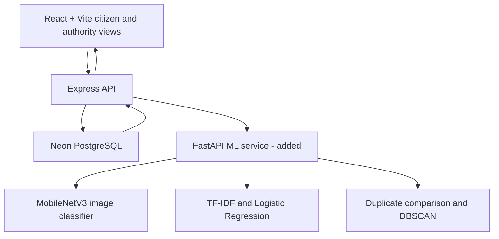

# RapidResQ ML upgrade

## Scope and current status

This extends the existing React application on `origin/web-app`, based on commit `23864c3`. The repository's default `main` branch is a separate Flutter prototype. The violet citizen interface, dark authority dashboard, reporting, GPS, maps, uploads, dispatch status, units and timelines are retained.

The six implementation phases are present and locally tested. **No real incident dataset or trained incident model was supplied, so no production model weights or accuracy figures are included.** Missing models return `training_required`; submission remains available with explicit manual review. Synthetic fixtures are used only inside isolated software tests and are never loaded by the demo service.

## 1. Existing architecture and findings



Before the upgrade, `aiTriage.ts` tried an optional Gemini request and fell back to regular expressions. The fallback assigned randomized confidence, and the Gemini prompt requested an arbitrary confidence range. Both have been removed from the active triage flow. Old records without model provenance have their displayed confidence suppressed; original stored records are not destructively rewritten.

Existing APIs retained:

| Endpoint | Purpose |
|---|---|
| `GET /api/health` | Storage health |
| `GET /api/incidents` | Incident feed and department/status/priority filters |
| `GET /api/incidents/:id` | Citizen/authority tracking |
| `POST /api/ai/preview` | Multipart analysis preview |
| `POST /api/incidents` | Multipart incident submission |
| `PATCH /api/incidents/:id/status` | Dispatch status, unit, ETA, notes and proof |
| `GET /api/media/:id` | Persisted attachment retrieval |
| `GET /api/stats` | Dashboard counts |
| `POST /api/seed` | Local-only demo reset; still disabled with shared storage |

Express stores incidents in `rapidresq_incidents(id TEXT PRIMARY KEY, data JSONB)` and media in `rapidresq_media(id, mime_type, content)`. Without a database it uses seeded in-memory demo data; Vercel requires PostgreSQL. The frontend polls every three seconds. Vercel retains the existing Express entrypoint in `api/index.ts` and the existing rewrites.

## 2. Modified files

| File | Change |
|---|---|
| `backend/src/services/aiTriage.ts` | Compatibility export for the new ML adapter; removes random/keyword triage |
| `backend/src/server.ts` | Calls ML on preview/submission; adds analytics, evaluation and duplicate review routes |
| `backend/src/services/incidentStore.ts` | Atomic grouping, report counts, grouped tracking and honest demo/legacy provenance |
| `backend/src/types/index.ts`, `frontend/src/types/index.ts` | FLOOD, nullable confidence, model outputs, duplicate and analytics types |
| `frontend/src/services/api.ts` | Existing API client extended with new routes; abortable previews |
| `frontend/src/components/citizen/ReportIncidentScreen.tsx` | All six categories, debounced image/text analysis, optional Grad-CAM, explicit errors |
| `frontend/src/components/citizen/IncidentTrackerScreen.tsx` | Model provenance and duplicate status |
| `frontend/src/components/citizen/HomeScreen.tsx` | Accurate description of ML assistance |
| `frontend/src/components/authority/AuthorityDashboard.tsx` | Summary counts, duplicate review and analytics/evaluation tabs |
| `frontend/src/components/common/InteractiveMap.tsx` | Reuses Leaflet with hotspot circles |
| `frontend/vite.config.ts` | Optional API proxy override for isolated local runs |
| `backend/.env.example`, `.gitignore`, dependency manifests | ML configuration, artifact exclusions and PostgreSQL test dependency |

## 3. New files

```text
backend/src/services/
  mlClient.ts                 # Private Node -> FastAPI client, bounded timeout
  mlTriage.ts                 # Validates predictions; explicit manual-review fallback
  incidentAnalytics.ts        # Candidate selection, context lookup, hotspot adapter
  presentIncident.ts          # Honest legacy display and grouped-report tracking
backend/tests/
  ml.test.ts
  duplicates.postgres.test.ts
frontend/src/components/authority/
  DuplicateReview.tsx
  MLAnalytics.tsx
frontend/src/components/common/MLPredictionDetails.tsx
frontend/src/utils/mlFormatting.ts
ml-service/
  app.py
  schemas.py
  fusion.py
  analytics.py
  image_model/model.py
  text_model/model.py
  datasets/images.csv         # Header-only input template
  datasets/text.csv           # Header-only input template
  training/data.py
  training/train_image.py
  training/train_text.py
  evaluation/evaluate.py
  models/image/               # Trained artifacts go here, not in React
  models/text/
  tests/                     # Unit, training/evaluation and local HTTP checks
  requirements.txt
  Dockerfile
  .env.example
```

## 4. Dependencies

The React/Vite/Leaflet and Express/Neon dependencies remain. Backend development adds PGlite to execute the real PostgreSQL statements during tests without contacting a hosted database. No new frontend package is required.

The ML service uses FastAPI, Uvicorn, python-multipart, PyTorch/Torchvision, scikit-learn, NumPy, Pillow, ImageHash and joblib. Pytest and HTTPX support checks. Tested versions are in `ml-service/requirements.txt`; the Dockerfile installs CPU PyTorch wheels. Training scripts default to a CPU-friendly frozen MobileNetV3 backbone with a learned six-class head.

## 5. Database changes

No table replacement or destructive migration is required because incidents already use JSONB. New reports add:

- `aiAnalysis.source`, model status/version, probabilities, image top-three, text severity/features, latency, optional Grad-CAM, and a fusion explanation.
- `reportText` containing the submitted text before any display defaults. This prevents invented fallback text from affecting duplicate matching.
- `reportCount` (defaults to one), `duplicateCheck`, and an optional `duplicate` object with match evidence and authority review details.
- `isDemo` for seeded local scenarios, which are excluded from hotspot analysis.

Possible duplicates remain independent pending authority review. Confirmation atomically marks the secondary record `CONFIRMED` and increments the primary record once. The original description, media and timeline remain in storage. Confirmed secondary reports disappear from the default dispatch queue but remain available through “Show grouped reports” and the primary report's linked evidence. Higher reported priority is preserved. Rejection retains a separate incident. A repeated/stale review returns HTTP 409 instead of incrementing again. Grouped citizen records follow the primary incident's current status and subsequent timeline updates.

## 6. Models and datasets required

### Image

MobileNetV3-Small is fine-tuned for `FIRE`, `ACCIDENT`, `FLOOD`, `MEDICAL`, `CRIME`, and `CIVIC`. `CIVIC` is the API label for civic/pothole reports; the older `HAZARD` label remains for unknown citizen selections. ImageNet pretrained weights are only a starting point, not an incident classifier. Inference loads a compatible trained checkpoint and returns its actual softmax distribution.

Candidate sources needing review and mapping:

- [D-Fire, original dataset repository](https://github.com/gaia-solutions-on-demand/DFireDataset): fire/smoke images and annotations. Its original detection labels require a documented image-level mapping.
- [CrisisMMD, original release](https://crisisnlp.qcri.org/crisismmd): paired disaster text/images; relevant examples need manual mapping to RapidResQ's taxonomy.
- [RDD2022, authors' dataset paper](https://arxiv.org/abs/2209.08538): road-damage imagery, including material relevant to civic road hazards.

These are source candidates, not an already assembled six-class training set. ACCIDENT, MEDICAL and CRIME need suitable licensed, reviewed examples. Medical urgency and criminal activity cannot reliably be established from appearance alone. Define the labels as report/scene categories and document this limit. Collect representative Indian/local scenes; avoid learning watermarks, source websites or location cues as category shortcuts.

### Text

The text module fits a shared TF-IDF vectorizer and separate Logistic Regression classifiers for category and priority. It uses `predict_proba`, not keyword thresholds. The severity score is the expected ordinal priority: `P(MEDIUM)/3 + 2*P(HIGH)/3 + P(CRITICAL)`. Features are TF-IDF values multiplied by the selected priority class's learned coefficients.

A reviewed text dataset must include title/description, one of six categories and one of four priorities. Human priority annotation needs a consistent rubric and reviewer agreement; disaster relevance or sentiment labels are not interchangeable with urgency labels. Do not use generated examples to claim real-world test performance.

### Split and evaluation rules

Both manifests require explicit `train`, `val`, `test`, `group_id`, source and license. Keep the same event, near-duplicate images and repeated reports in one split. Scripts reject exact content/group leakage across splits and exact perceptual image-hash leakage. Human event grouping is still necessary for near-duplicates and related video frames. Each split must contain every target class. These structural checks do not prove that a dataset is sufficiently large or representative.

Train only on training data. Image checkpoint selection and text regularization selection use validation data. Evaluation is a separate command on held-out test data and generates accuracy, macro precision/recall/F1, per-class performance, confusion matrix, sample count, version, fingerprint, timestamp and measured CPU latency. Abstentions remain errors in the denominator. The dashboard refuses mismatched model-version evaluation artifacts. Model probabilities are uncalibrated classifier outputs; they are not evidence that an incident is real or that severity is certain.

## 7. Incremental implementation and verification

| Phase | Implemented behavior | Remaining prerequisite |
|---|---|---|
| 1 — Image | FastAPI, MobileNetV3 training/inference, top-three, real softmax, optional Grad-CAM | Reviewed image dataset and trained checkpoint |
| 2 — Text | TF-IDF + Logistic Regression training/inference and feature contributions | Reviewed category/priority text dataset |
| 3 — Fusion | Explicit image/text score policy, context adjustment and SOS override | Validate/tune policy against reviewed incidents; optional verified geographic zones |
| 4 — Duplicates | pHash/text cosine + 200 m/2 h gates, review, atomic counts, retained evidence | Locality/threshold evaluation on actual reports |
| 5 — Hotspots | DBSCAN in radians with haversine distance, 1/7/30-day windows, map and daily trends | Enough actual incident locations for meaningful clusters |
| 6 — Evaluation | Real evaluation writer and version-matched dashboard | Run held-out evaluation of trained models |

Tests cover original GPS/submission/status behavior, probability validation, missing models, invalid media, upload limits, context, leakage, model computation/Grad-CAM, duplicate thresholds, PostgreSQL atomicity/idempotency, grouping, and DBSCAN. Training/evaluation scripts are exercised on isolated synthetic software-test fixtures; their metrics are not project benchmark results. A local HTTP check exercises Node -> FastAPI -> incident store -> authority review -> grouped tracking.

## Fusion policy v1

- When image and text models both return predictions: `score = 0.8 * text_severity + 0.2 * expected_image_category_risk`.
- Image risk weights are explicit operational policy: FIRE/MEDICAL 0.8, ACCIDENT/FLOOD/CRIME 0.7, CIVIC 0.25. They are not learned severity or confidence values.
- Verified populated-area context adds 0.10, capped at 1. No configured source means no adjustment; coordinates alone do not imply population density. Node resolves context from `ML_CONTEXT_ZONES`, never a citizen-supplied claim.
- Thresholds: LOW <0.25, MEDIUM <0.50, HIGH <0.80, otherwise CRITICAL. A text classifier's CRITICAL result is preserved. Explicit citizen SOS overrides priority to CRITICAL and records that policy decision.
- Text-only uses its severity score. Image-only cannot establish urgency: HIGH/manual review is used and the fusion score stays null. Missing models also use HIGH/manual review with null confidence.
- Disagreement, low model probability and missing modalities are flagged for review. Department recommendations are a documented category/priority mapping, not a separately trained routing model.

This is a testable initial policy, not a validated emergency dispatch system. Multimodal policy weights and thresholds need validation before operational use.

## New HTTP APIs

Node: `GET /api/ml/status`, `GET /api/ml/evaluation`, `GET /api/analytics/hotspots?days=7`, `PATCH /api/incidents/:id/duplicate` with JSON `{ "decision": "CONFIRM" }` or `REJECT`.

FastAPI (private, called only by Node): `GET /health`, `POST /analyze` multipart, `POST /duplicates`, `POST /hotspots`, `GET /evaluation`. The upload limit remains 4 MB. Video uploads are preserved but explicitly marked unsupported by the image classifier. Timeout/service failure never fabricates a result and never suppresses a report.

Duplicate comparison is bounded to 500 nearby candidates; hotspots use up to the latest 5,000 incidents in the selected window, with truncation disclosed. Pending duplicate reports can inflate observed hotspot counts until confirmed. Simultaneous submissions can both precede each other's candidate check; they remain visible for authority review, with no destructive automatic merge.

## Running and deployment

See `ml-service/README.md` for exact install, training, evaluation and service commands. Keep the existing Vercel application. Deploy FastAPI separately to a Python/container runtime, provide trained models, set a private service key, and configure Node's `ML_SERVICE_URL`/`ML_SERVICE_KEY` in Vercel. A browser must never receive that key. The existing authority interface has no authentication/role enforcement; this inherited limitation also applies to review routes and must be addressed before public operational use.

No GitHub push, Vercel deployment, hosted database change or public ML service deployment was performed by this upgrade. The reviewed source and patch are the deliverables; running the current hosted URL will continue to show its previously deployed code until deployment is performed.
