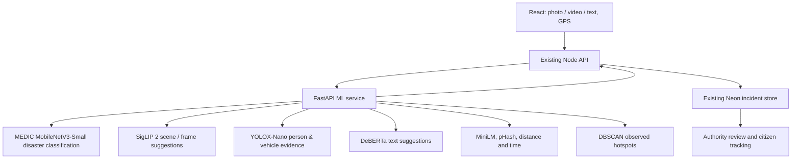

# RapidResQ ML upgrade

## Existing architecture preserved

Based on the existing React/Vite `web-app` branch at `23864c3`, not the older Flutter `main` branch. React sends reports to the existing Express API; Node calls a separate Python/FastAPI service. Results return through Node to the existing Neon PostgreSQL JSONB incident store and authority/citizen views. Uploads, GPS, maps, status updates and evidence retention remain intact.

## Current implementation

1. Real trained MEDIC disaster classification (MobileNetV3-Small linear head trained on 63,194 cleaned images; evaluated on 15,554 test images).
2. Video frame sampling with PyAV (up to 6 frames, <=30s, 1080p, 4MB) for scene classification and YOLOX-Nano person/vehicle evidence.
3. Real pretrained image/text/embedding inference, pinned model revisions, explicit one-time setup and offline serving. No random confidence or pretrained-as-project-training claims.
4. Explainable fusion and routing with authority review, uncertainty handling, unknown category and unknown urgency options. Long text is declined visibly rather than silently truncated.
5. Possible duplicates combine semantic/lexical similarity, image hashes, distance and time. Human confirmation retains evidence and updates report counts once through atomic SQL. Grouped reports follow the primary incident's status.
6. DBSCAN hotspots and observed daily trends retain existing map components. Confirmed duplicates count once and seeded demo reports are excluded. No forecasting.
7. Dashboard shows model provenance, candidate match scores, uncertainty, object evidence and actual duplicate method. Model evaluation shows held-out test metrics for MEDIC.
8. Retained optional pipelines for MobileNetV3/TF-IDF and modular UCF-Crime / XD-Violence supervised video training.

## Main changed/new files

- `ml-service/medic/`: MEDIC transfer-learning classifier, release installer, and label-routing adapters.
- `ml-service/detector/`: YOLOX-Nano ONNX object detection for person and vehicle evidence.
- `ml-service/video/`: PyAV frame sampling, per-frame scene analysis, and temporal classification interface.
- `ml-service/training/`: MEDIC download/prepare/train scripts; UCF-Crime video dataset preparation and GRU training pipeline.
- `ml-service/pretrained/`: revision lock, resumable download command and adapters for SigLIP 2, DeBERTa, and MiniLM.
- `ml-service/app.py`, `fusion.py`, `analytics.py`: model selection, bounded inference, policy and semantic duplicate matching.
- `ml-service/evaluation/`: test evaluation scripts and `verify_medic.py`.
- `backend/src/services/mlClient.ts`, `mlTriage.ts`, `incidentAnalytics.ts`: private service calls, validated provenance, object evidence and duplicate/context integration.
- `backend/src/services/incidentStore.ts`, `presentIncident.ts`, `backend/src/server.ts`: preserved reporting/status APIs, explicit legacy confidence, atomic duplicate review and analytics endpoints.
- `frontend/src/components/common/MLPredictionDetails.tsx`, `authority/MLAnalytics.tsx`, `authority/DuplicateReview.tsx`: shared prediction, evaluation, object evidence and duplicate views.
- Citizen reporting, shared types and formatting: existing design retained, with honest score labels and optional explanations.

## Database and API compatibility

No schema migration is required: incident data remains in the existing `rapidresq_incidents.data` JSONB field. Added model metadata, report counts and duplicate evidence are stored inside that object. The existing media table remains unchanged. No hosted database was modified. A production backup and deployment review remain appropriate when applying any release.

Existing preview, incident submission/list/detail, status, media and stats routes remain. Added routes: GET `/api/ml/status`, GET `/api/ml/evaluation`, GET `/api/analytics/hotspots?days=7`, and PATCH `/api/incidents/:id/duplicate` with CONFIRM/REJECT. The browser never receives the private service key.

## Models, dependencies and remaining data work

Runtime: FastAPI/Uvicorn, PyTorch, Torchvision, Transformers, Hugging Face Hub, safetensors, SentencePiece, PyAV, ONNX Runtime, scikit-learn, NumPy, Pillow and ImageHash. Exact tested dependencies are in `ml-service/requirements.txt`; training dependencies in `ml-service/requirements-training.txt`.

MEDIC provides disaster-type image classification (earthquake, flood, hurricane, fire, landslide, normal, other). It does not determine dispatch priority or replace human authority review. Supervised temporal video anomaly model remains training_required pending permitted dataset footage.

See `ml-service/README.md` for exact setup, model behavior, limits, test manifests, training guides and separate Python hosting. See `docs/VALIDATION.md` for the checks actually performed.

