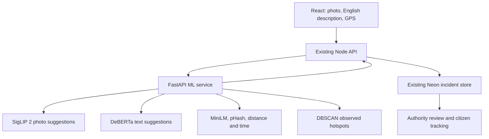

# RapidResQ ML upgrade

## Existing architecture preserved

Based on the existing React/Vite `web-app` branch at `23864c3`, not the older Flutter `main` branch. React sends reports to the existing Express API; Node calls a separate Python/FastAPI service. Results return through Node to the existing Neon PostgreSQL JSONB incident store and authority/citizen views. Uploads, GPS, maps, status updates and evidence retention remain intact.

## Current implementation

1. Real pretrained image/text/embedding inference, pinned model revisions, explicit one-time setup and offline serving. No random confidence or pretrained-as-project-training claims.
2. Explainable fusion and routing with authority review, uncertainty handling, unknown category and unknown urgency options. Long text is declined visibly rather than silently truncated.
3. Possible duplicates combine semantic/lexical similarity, image hashes, distance and time. Human confirmation retains evidence and updates report counts once through atomic SQL. Grouped reports follow the primary incident's status.
4. DBSCAN hotspots and observed daily trends retain existing map components. Confirmed duplicates count once and seeded demo reports are excluded. No forecasting.
5. Dashboard shows pretrained provenance, candidate match scores, uncertainty and actual duplicate method. Model evaluation is blank until a matching genuine held-out test artifact exists.
6. Original MobileNetV3 and TF-IDF/Logistic Regression training/evaluation code remains optional for future project-specific datasets.

## Main changed/new files

- `ml-service/pretrained/`: revision lock, resumable download command and adapters for all three models.
- `ml-service/app.py`, `fusion.py`, `analytics.py`: model selection, bounded inference, policy and semantic duplicate matching.
- `ml-service/image_model/`, `text_model/`, `training/`: original trainable baselines retained.
- `ml-service/evaluation/evaluate.py`: separate trained/pretrained evaluation with version matching and abstentions.
- `backend/src/services/mlClient.ts`, `mlTriage.ts`, `incidentAnalytics.ts`: private service calls, validated provenance and duplicate/context integration.
- `backend/src/services/incidentStore.ts`, `presentIncident.ts`, `backend/src/server.ts`: preserved reporting/status APIs, explicit legacy confidence, atomic duplicate review and analytics endpoints.
- `frontend/src/components/common/MLPredictionDetails.tsx`, `authority/MLAnalytics.tsx`, `authority/DuplicateReview.tsx`: shared prediction, evaluation and evidence views.
- Citizen reporting, shared types and formatting: existing design retained, with honest score labels and optional explanations.

## Database and API compatibility

No schema migration is required: incident data remains in the existing `rapidresq_incidents.data` JSONB field. Added model metadata, report counts and duplicate evidence are stored inside that object. The existing media table remains unchanged. No hosted database was modified. A production backup and deployment review remain appropriate when applying any release.

Existing preview, incident submission/list/detail, status, media and stats routes remain. Added routes: GET `/api/ml/status`, GET `/api/ml/evaluation`, GET `/api/analytics/hotspots?days=7`, and PATCH `/api/incidents/:id/duplicate` with CONFIRM/REJECT. The browser never receives the private service key.

## Models, dependencies and remaining data work

Runtime: FastAPI/Uvicorn, PyTorch, Transformers, Hugging Face Hub, safetensors, SentencePiece, scikit-learn, NumPy, Pillow and ImageHash. Exact tested dependencies are in `ml-service/requirements.txt`; model revisions/licenses are in `pretrained/models.lock.json`. MiniLM uses the official mean-pooling approach through Transformers, without an additional Sentence Transformers dependency.

No suitable labeled photo/text dataset has been supplied. The archive contains historical disaster records and was not used for triage training. Real incident examples, reviewed category/priority labels, negative/ambiguous cases and event-separated evaluation are still needed. Candidate prompts and uncertainty/similarity thresholds are initial policy choices, not optimized or calibrated results. Do not claim a project accuracy or dispatch readiness from the software smoke tests.

See `ml-service/README.md` for exact setup, model behavior, limits, test manifests, optional training and separate Python hosting. See `docs/VALIDATION.md` for the checks actually performed. No GitHub push or Vercel deployment was performed.
